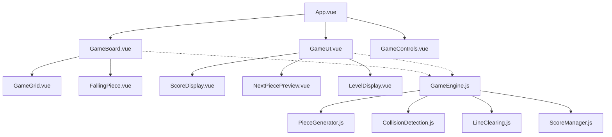

# Design Document

## Overview

The Vue.js Tetris clone will be built as a single-page application using Vue 3's Composition API. The architecture follows a component-based design with clear separation of concerns between game logic, rendering, and user input handling. The core innovation lies in the random piece generation algorithm that creates valid, connected shapes within a 4x4 constraint.

## Architecture

### High-Level Architecture



### State Management

The application will use Vue 3's reactive state management with a centralized game store using `reactive()` and `computed()` for optimal performance:

- **Game State**: Current board state, active piece, score, level, game status
- **Piece State**: Current falling piece, next piece preview, piece position and rotation
- **UI State**: Animation states, visual effects, input handling

## Components and Interfaces

### Core Components

#### 1. App.vue (Root Component)
- **Purpose**: Main application container and game orchestration
- **Responsibilities**: 
  - Initialize game engine
  - Handle global keyboard events
  - Manage game lifecycle (start, pause, game over)
  - Coordinate between child components

#### 2. GameBoard.vue
- **Purpose**: Main game area rendering and piece management
- **Props**: `gameState`, `currentPiece`, `boardData`
- **Responsibilities**:
  - Render the 10x20 game grid
  - Display locked pieces
  - Show the currently falling piece
  - Handle piece animations

#### 3. GameGrid.vue
- **Purpose**: Individual cell rendering and grid visualization
- **Props**: `gridData`, `cellSize`
- **Responsibilities**:
  - Render individual grid cells
  - Apply cell colors and states
  - Handle cell animations (line clearing effects)

#### 4. FallingPiece.vue
- **Purpose**: Active piece rendering and movement visualization
- **Props**: `piece`, `position`, `rotation`
- **Responsibilities**:
  - Render the current falling piece
  - Handle piece movement animations
  - Show piece rotation transitions

#### 5. NextPiecePreview.vue
- **Purpose**: Display upcoming piece
- **Props**: `nextPiece`
- **Responsibilities**:
  - Render preview of next piece in smaller grid
  - Center piece within preview area

#### 6. GameUI.vue
- **Purpose**: Game information display container
- **Responsibilities**:
  - Layout score, level, and next piece components
  - Handle UI animations and transitions

### Game Engine Modules

#### 1. GameEngine.js
```javascript
interface GameEngine {
  // Game state management
  initializeGame(): void
  startGame(): void
  pauseGame(): void
  endGame(): void
  
  // Game loop
  gameLoop(): void
  updateGame(deltaTime: number): void
  
  // Piece management
  spawnNewPiece(): void
  movePiece(direction: Direction): boolean
  rotatePiece(): boolean
  dropPiece(): void
  lockPiece(): void
  
  // Game mechanics
  checkLines(): number[]
  clearLines(lines: number[]): void
  updateScore(linesCleared: number): void
  updateLevel(): void
}
```

#### 2. PieceGenerator.js
```javascript
interface PieceGenerator {
  generateRandomPiece(): Piece
  validatePieceShape(shape: number[][]): boolean
  ensureConnectivity(shape: number[][]): boolean
  fitIn4x4Box(shape: number[][]): boolean
}

interface Piece {
  shape: number[][]  // 4x4 matrix with 1s for filled cells
  color: string
  size: number      // actual number of filled cells (4-7)
  boundingBox: { width: number, height: number }
}
```

#### 3. CollisionDetection.js
```javascript
interface CollisionDetection {
  checkCollision(piece: Piece, position: Position, board: Board): boolean
  checkBoundaries(piece: Piece, position: Position): boolean
  checkPieceOverlap(piece: Piece, position: Position, board: Board): boolean
  getValidRotation(piece: Piece, position: Position, board: Board): Piece | null
  performWallKicks(piece: Piece, position: Position, board: Board): Position | null
}
```

## Data Models

### Core Data Structures

#### Game State
```javascript
const gameState = reactive({
  board: Array(20).fill().map(() => Array(10).fill(0)), // 20 rows x 10 columns
  currentPiece: null,
  nextPiece: null,
  piecePosition: { x: 4, y: 0 },
  pieceRotation: 0,
  score: 0,
  level: 1,
  linesCleared: 0,
  gameStatus: 'ready', // 'ready', 'playing', 'paused', 'gameOver'
  fallTimer: 0,
  fallInterval: 1000, // milliseconds
})
```

#### Piece Structure
```javascript
const piece = {
  id: 'unique-id',
  shape: [
    [0, 1, 1, 0],
    [0, 1, 0, 0],
    [0, 1, 0, 0],
    [0, 1, 0, 0]
  ],
  color: '#FF6B6B',
  size: 5, // number of filled cells
  rotations: [/* pre-calculated rotation states */]
}
```

### Random Piece Generation Algorithm

The piece generation follows these steps:

1. **Seed Generation**: Start with a random cell in a 4x4 grid
2. **Growth Algorithm**: Use a modified flood-fill to add 3-6 additional connected cells
3. **Connectivity Validation**: Ensure all cells are connected (no isolated pieces)
4. **Shape Optimization**: Remove unnecessary empty rows/columns while maintaining 4x4 constraint
5. **Rotation Pre-calculation**: Generate all 4 rotation states for collision detection

```javascript
function generateRandomPiece() {
  const grid = Array(4).fill().map(() => Array(4).fill(0))
  const targetSize = Math.floor(Math.random() * 4) + 4 // 4-7 pieces
  
  // Start with random seed position
  const seedX = Math.floor(Math.random() * 4)
  const seedY = Math.floor(Math.random() * 4)
  grid[seedY][seedX] = 1
  
  // Grow piece using connected neighbors
  const filled = [{x: seedX, y: seedY}]
  
  while (filled.length < targetSize) {
    const expandFrom = filled[Math.floor(Math.random() * filled.length)]
    const neighbors = getEmptyNeighbors(expandFrom, grid)
    
    if (neighbors.length === 0) break
    
    const newCell = neighbors[Math.floor(Math.random() * neighbors.length)]
    grid[newCell.y][newCell.x] = 1
    filled.push(newCell)
  }
  
  return {
    shape: grid,
    color: getRandomColor(),
    size: filled.length
  }
}
```

## Error Handling

### Game State Errors
- **Invalid Moves**: Gracefully handle impossible piece movements without crashing
- **Collision Edge Cases**: Robust collision detection for complex random shapes
- **Performance Issues**: Implement piece generation caching and optimization

### User Input Errors
- **Rapid Key Presses**: Debounce input to prevent double-moves
- **Invalid Rotations**: Fall back to original position if rotation fails
- **Game State Conflicts**: Prevent input during line clearing animations

### Rendering Errors
- **Animation Glitches**: Ensure smooth transitions between game states
- **Piece Rendering**: Handle edge cases in random piece visualization
- **Responsive Layout**: Maintain game proportions across different screen sizes

## Testing Strategy

### Unit Testing
- **Piece Generation**: Validate random pieces meet all constraints (4-7 cells, connected, 4x4 box)
- **Collision Detection**: Test edge cases with complex random shapes
- **Line Clearing**: Verify correct behavior with multiple simultaneous line clears
- **Score Calculation**: Ensure accurate scoring for different scenarios

### Integration Testing
- **Game Flow**: Test complete game cycles from start to game over
- **Component Communication**: Verify proper data flow between Vue components
- **User Input**: Test all keyboard controls and their combinations
- **State Management**: Validate reactive state updates across components

### Performance Testing
- **Piece Generation Speed**: Ensure random generation doesn't cause frame drops
- **Rendering Performance**: Maintain 60fps during active gameplay
- **Memory Usage**: Monitor for memory leaks during extended play sessions

### Visual Testing
- **Cross-browser Compatibility**: Test rendering across modern browsers
- **Responsive Design**: Verify layout on different screen sizes
- **Animation Smoothness**: Ensure fluid piece movements and effects